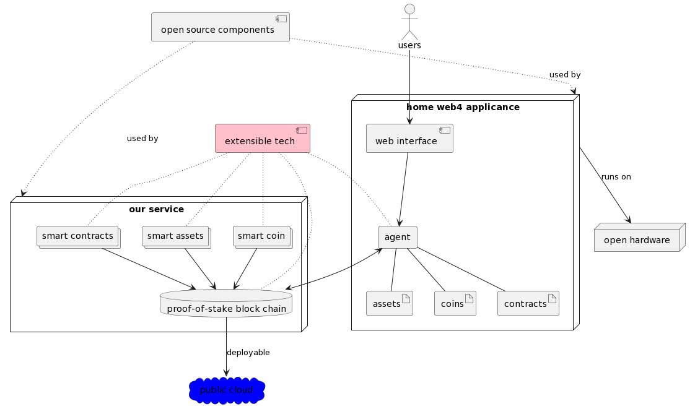

# Open Source Vision

## Venture Name, Purpose and Tech generator

We are a (fictional) start-up in stealth mode and we want to create an open-source (business) strategy.

We invented a technology (_FutureWeb_) which will revolutionize the web and is the next big thing after web3. 

Our goal today is to research and develop an open-source strategy before we publicly launch our service.

❥ _Create groups of max 3 people._

## Name

Every venture need a brand! Let start with a catchy name.

- Each member of this venture picks a color and write this down on a paper and make sure nobody can see it.
- Each member of this venture picks an animal and write this down on a paper and make sure nobody can see it.blind fold it

|   | Color | Animal |
| :-- | ------- | -------- |
| 1 | Red   | Cat    |
| 2 | Blue  | Dog    |
| 3 | Pink  | Whale  |
| 4 | Gold  | Lizard |

* One team member picks randomly a color & animal.
* Concat Color + Animal + " Technologies" = Your team Venture name
  * eg. 1 + 4 = **RedLizard Technologies**
  * eg. 2 + 1 = **BlueCat Technologies**

❥ _Time it for max 5 minutes._

## Tech

Our service consists of a special home appliance based on open hardware and security and the user interact with their assets, contract and crypto using our distributed service running on multiple clouds and our special home appliances. 

❥ _Explain the tech briefly for max 5 minutes._

## Open Source business models

**Which Open Source business model are we going for?**

☞ _Research at least three different open source business models (eg. Open-Core, Hosting, Professional Services, Marketplace…). Choose one and select one component of your tech stack to work with._

Why is this the best option for your teams company?

❥ _Each team use a copy of [the workshop template](../training_output/company/template.html) for capturing all the ideas. Max 20 minutes and 10 minutes of sharing (not all teams have to share, all results can be seen afterwards)._